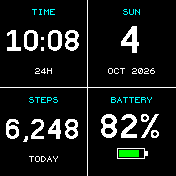

# Four Squares

A separate clock app for Bangle.js 2. Its full 176x176 display is divided into four equal 88x88 tiles:

| Top left | Top right |
| --- | --- |
| Digital time (HH:MM) | Weekday, date, month and year |
| **Bottom left** | **Bottom right** |
| Today's steps | Battery percentage, gauge and charging status |

The face uses a black background, white numbers and cyan labels. It follows the watch's 12/24-hour setting and uses its locale for weekday and month names. There is no widget strip, which leaves the entire screen available for the four squares.

The time updates on each minute boundary, including while locked. Steps update within a second of a pedometer event; the tile reads the watch's daily health total rather than its total since reboot. Battery percentage refreshes each minute, and charging changes refresh immediately. Only changed tiles are redrawn. Press the hardware button to open the usual launcher.

The four tiles display information only in this first version. Tap actions can be added in a later iteration.

## Install directly

1. Open [the Espruino Web IDE](https://www.espruino.com/ide/) in a browser that supports Web Bluetooth and connect to your watch.
2. Open `../../dist/quadclock-install.js` in the IDE's right-hand editor, keep the upload target set to **RAM**, and send it to the watch. The installer writes `quadclock.app.js`, `quadclock.img` and `quadclock.info` into Storage and opens the clock.
3. To make it your usual face, open the watch's **Settings > Select Clock** and choose **Four Squares**.

The installer updates only this app's three files. It does not select a default clock automatically. Keep the upload target on RAM for the installer so it does not replace your watch's boot code.

For an immediate temporary preview, send just `app.js` to RAM instead.

## Use your BangleApps fork

Copy this `quadclock` directory into your fork's `apps/` directory alongside your existing apps. The App Loader reads `metadata.json` and creates `quadclock.info` automatically. `app-icon.js` is an image expression evaluated by the loader; it is not a script to upload unchanged as an image.

## Rebuild the direct installer

From the project root, run `node tools/build-quadclock.cjs`. This rebuilds the app icon and `dist/quadclock-install.js` without external packages.

To run the behavior and rendering checks in an official Bangle.js 2 emulator, run `node tools/verify-quadclock.cjs /path/to/EspruinoAppLoaderCore/lib/emulator.js`. The runner expects an `EspruinoWebIDE` checkout in the usual adjacent location. The emulator dependencies are not bundled with the app.

Daily steps come from `Bangle.getHealthStatus("day").steps`. A reset of the watch can reset that total; this app does not maintain a second step database. Battery percentage is the estimate supplied by the watch.
