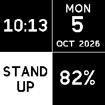

# Four Squares

A monochrome clock for Bangle.js 2, using the whole 176x176 screen as four equal 88x88 squares.

| Top left | Top right |
| --- | --- |
| Digital time | Weekday, date, month and year |
| **Bottom left** | **Bottom right** |
| Today's step count | Battery percentage |

Time, steps and battery percentage are displayed without headings. Weekday and month/year text are larger than in version 0.01. Everything is black and white. The clock follows your watch's 12/24-hour setting; AM/PM appears only in 12-hour mode. Charging is shown in white text beneath the battery percentage.

Step counts above 10,000 are supported. Numbers keep their thousands separators and automatically shrink to fit the square, including six-digit counts such as 123,456.

## Stand-up reminder

Every five minutes while this clock is running, the watch vibrates for half a second and the bottom-left square turns white with black **STAND UP** text.

The reminder remains visible until you tap that square. Other squares do not dismiss it. The step counter continues in the background; dismissing the reminder restores the latest daily total in white on black. Minute updates, steps and unlocking the watch do not clear a pending reminder.

The first reminder is five minutes after opening the clock. Further reminders follow the same five-minute schedule, with another vibration if a reminder is still pending. Reminders continue while the watch is locked; unlock it before tapping. Leaving the clock stops its reminder timer. Opening it again starts a new five-minute schedule.

Press the hardware button to open the usual launcher. Widgets are omitted so the tiles use the full display.

## Install through your App Loader

Upload this folder's files into `apps/quadclock/` in your BangleApps GitHub fork, replacing the previous version. Keep the filenames unchanged. Commit the update, wait for GitHub Pages to rebuild, and open your own App Loader. Update **Four Squares** to version **0.02**.

To make it your usual clock, choose **Settings > Select Clock > Four Squares** on the watch.

The folder contains everything needed by the App Loader. No build scripts or separate installer are required. The App Loader uses `metadata.json` to install the code and icon and generates `quadclock.info` automatically.

Daily steps use `Bangle.getHealthStatus("day").steps`; resetting the watch can reset that total. Battery percentage is the estimate supplied by the watch.
